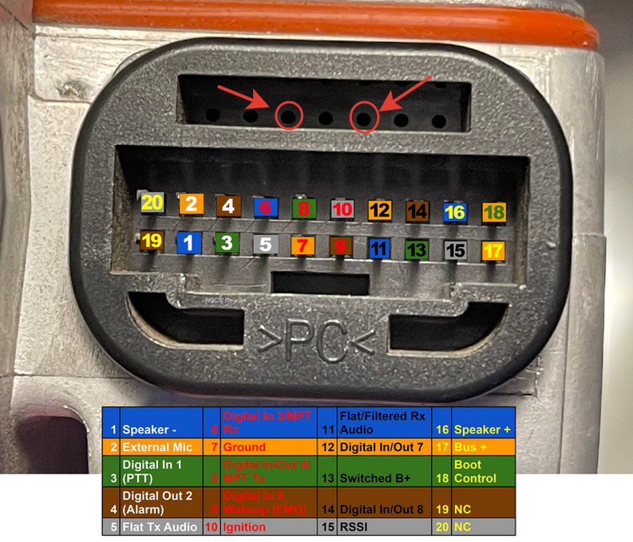
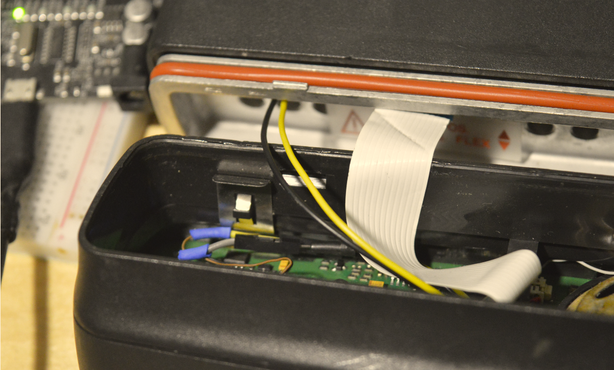
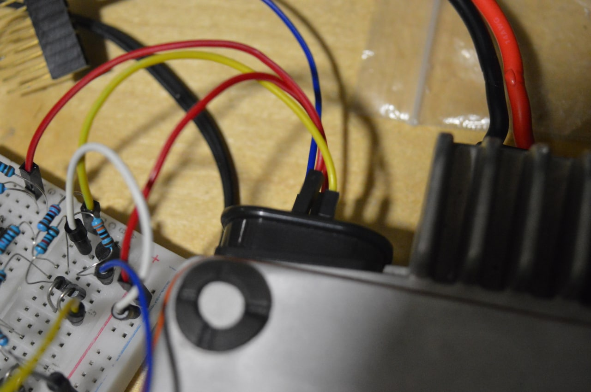

- В статье будет рассмотрен вариант взаимодействия с передней панелью "американской" версии GM360. Этот способ также применим и для "европейских" GM360.
- Механизмы приема и передачи аудиосигнала в этой статье *НЕ РАССМАТРИВАЮТСЯ*
- Вы можете использовать идеи, описанные в статье по своему усмотрению. Помните о том, что любые действия, описанные в данной инструкции, вы совершаете на *СВОЙ СТРАХ И РИСК*. Автор не несет никакой ответственности за возможный выход из строя вашего оборудования.

# [](#header-1) Часть 1. Аппаратная.
## [](#header-2) Детали и материалы

- Arduino Uno
- Резисторы близкие к номиналам 13К, 22К, 43К 
- Мелкие диоды Шоттки
  
## [](#header-2) Алгоритм обнаружения нажатия клавиш

Внимательно смотрим [сервис-мануал](/docs/MotorolaGM.pdf) и видим, что каждая кнопка имеет условные "координаты" ROW(строка) и COL (столбец).


Motorola GM использует двумерную резистивную матрицу для обнаружения нажатых клавиш передней панели. При нажатии происходит "просадка" линии COL и линии ROW через цепочку резисторов на землю. Путем измерения напряжения на соотвествующих линиях процессор определяет какая именно клавиша была нажата.

## [](#header-2) Вывод контрольных точек наружу

Еще раз внимательно смотрим на схему матрицы. Контрольные точки обведены красным. 


Чтобы иметь возможность "нажимать" кнопки удаленно, потребуется вывести их наружу. Самым простым способом оказалось подпаяться к 13 (COL) и 15 (ROW) аналоговым входам чипа передней панели.


Я подпаял тонкие проводки с "мамами" на конце, чтобы можно было полностью снять переднюю панель при необходимости. 


Далее протягиваем два тонких провода "папа-папа" (я взял с макетки ардуино) на верхнюю часть заднего аксессуарного разъема, где имеются свободные отверстия, но отсутствуют контактные штыри. 



На фото видны выведенные назад провода черного и желтого цвета.




И сзади эти провода видны как красный и желтый



## [](#header-2) Схема подключения Arduino к мотору

Для съема показаний дисплея потребуется подключить шину данных к пину D2. Дублер резистивной матрицы подключаем к дополнительным выводам аксессуарного разъема, которые мы приготовили в предыдущем шаге.


Схему можно [открыть](/docs/Schematics.fzz) с помощью [Fritzing](https://fritzing.org/)

# [](#header-1) Часть 2. Программная.
## [](#header-2) Arduino

Ниже приведен пример скетча, обеспечивающего взаимодействие между внешним ПО и радиостанцией с помощью последовательного порта. По командам, приходящим с компьютера, происходит "нажатие" требуемых кнопок. Показания дисплея периодически "улетают" в компьютер так же через последовательный порт.

```c++

//https://t.me/SATCOM_UHF
#include <SoftwareSerial.h>
 
SoftwareSerial bus(2, 3);
void setup()
{
    int i = 5;
    while (i <= 11)
    {
        pinMode(i, OUTPUT);
        digitalWrite(i, HIGH);
        i++;
    }
    digitalWrite(8, LOW);
    Serial.begin(115200);
    bus.begin(9600);
    bus.listen();
}

void click(int rowV, int colV, bool longClick)
{
    bool levelR = rowV == 8;
    digitalWrite(rowV, levelR);
    digitalWrite(colV, LOW);
    if (longClick)
    {
        delay(2000);
    }
    else
    {
        delay(250);
    }
    digitalWrite(rowV, !levelR);
    digitalWrite(colV, HIGH);
}

bool Check(String expected, String received, int row, int col)
{
    if (received.equalsIgnoreCase(expected))
    {
        click(row, col, received == expected);
        return true;
    }
    return false;
}
void loop()
{  
   while (bus.available()) {
    byte SBEP_byte = bus.read();
    Serial.write(SBEP_byte);
   }
    if (Serial.available())
    {
        String cmd = Serial.readString();
        Check("P2", cmd, 8, 5)
        || Check("UP", cmd, 8, 6)
        || Check("LEFT", cmd, 8, 7)
        || Check("P1", cmd, 9, 5)
        || Check("DOWN", cmd, 9, 6)
        || Check("EXIT", cmd, 9, 7)
        || Check("P4", cmd, 10, 5)
        || Check("RIGHT", cmd, 10, 7)
        || Check("P3", cmd, 11, 5)
        || Check("OK", cmd, 11, 7);
    }
}

```

## [](#header-2) Бот

Шаг первый: создайте своего бота и получите токен для работы с ним. Подробно описывать этот шаг не имеет смысла, полно материалов в сети:

- [статья на русском](https://botcreators.ru/blog/botfather-instrukciya/)
- [официальная документация](https://core.telegram.org/bots#6-botfather)
  
