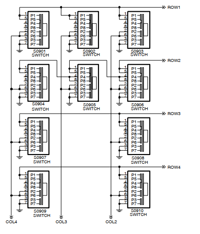
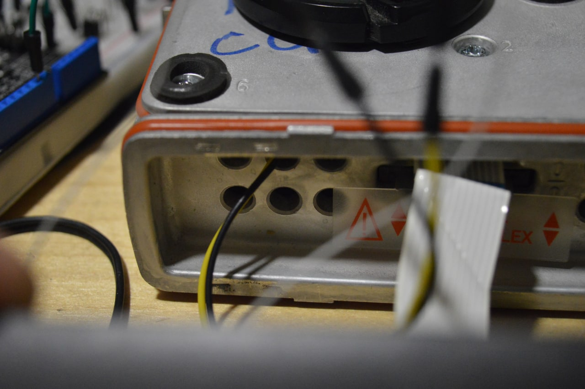

- В статье будет рассмотрен вариант взаимодействия с передней панелью "американской" версии GM360. Этот способ также применим и для "европейских" GM360.
- Механизмы приема и передачи аудиосигнала в этой статье *НЕ РАССМАТРИВАЮТСЯ*
- Вы можете использовать идеи, описанные в статье по своему усмотрению. Помните о том, что любые действия, описанные в данной инструкции, вы совершаете на *СВОЙ СТРАХ И РИСК*. Автор не несет никакой ответственности за возможный выход из строя вашего оборудования.

#  Часть 1. Аппаратная.
##  Детали и материалы

- Arduino Uno
- Резисторы 13К, 22К, 43К, 130К - каждой твари по паре
- Мелкие диоды
  
##  Алгоритм обнаружения нажатия клавиш

Внимательно смотрим [сервис-мануал](/docs/MotorolaGM.pdf) и видим, что каждая кнопка имеет условные "координаты" ROW(строка) и COL (столбец).

Motorola GM использует двумерную резистивную матрицу для обнаружения нажатых клавиш передней панели. 

 При нажатии происходит "просадка" линии COL и линии ROW через цепочку резисторов на землю. Путем измерения напряжения на соотвествующих линиях процессор определяет какая именно клавиша была нажата.

##  Вывод контрольных точек наружу

Еще раз внимательно смотрим на схему матрицы. Контрольные точки обведены красным. 

Чтобы иметь возможность "нажимать" кнопки удаленно, потребуется вывести их наружу. Самым простым способом оказалось подпаяться к 13 (COL) и 15 (ROW) ногам чипа

Я подпаял тонкие проводки от IDE шлейфа с "мамами" на конце, чтобы можно было полностью снять переднюю панель при необходимости. 

Далее протягиваем два тонких провода "папа-папа" (я взял с макетки ардуино) на верхнюю часть заднего аксессуарного разъема, где имеются свободные отверстия, но отсутствуют контактные штыри. 

На фото видны подключенные к новым штырям провода красного и желтого цвета.

##  Схема подключения Aruino к мотору

тут будет схема с номиналами и ссылками на пины Uno

#  Часть 2. Программная.
##  Arduino Firmware
Скетч для Arduino Uno вы пожете найти в нашем репозитории: [тыц](https://github.com/satcom-uhf/Bot/blob/main/ArduinoAdapter/ArduinoAdapter.ino)

##  Бот

Шаг первый: создайте своего бота и получите токен для работы с ним. Подробно описывать этот шаг не имеет смысла, полно материалов в сети:

- [статья на русском](https://botcreators.ru/blog/botfather-instrukciya/)
- [официальная документация](https://core.telegram.org/bots#6-botfather)
  
